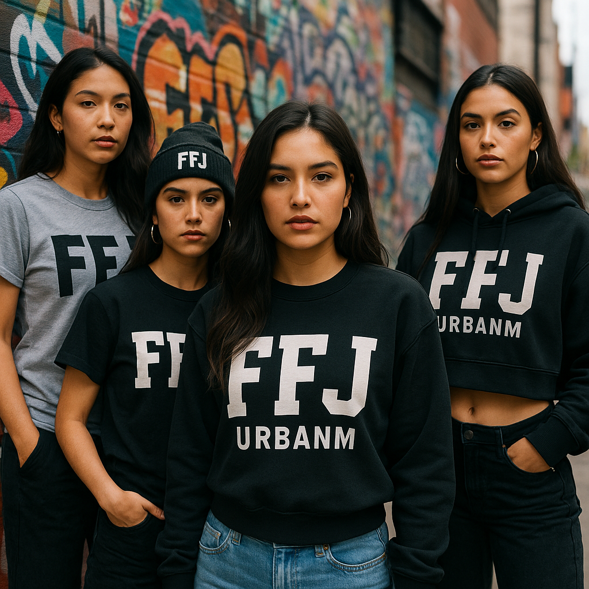

<!-- Siempre Nuevo - Urban Streetwear Platform -->

<p align="center">
  
</p>

<h1 align="center">Siempre Nuevo 🔥✨</h1>

<p align="center">
  <b>Bold Urban Streetwear for Fearless Women</b><br/>
  <a href="https://vercel.com/digital-herencia/siempre-nuevo">Live Site</a> • <a href="#features">Features</a> • <a href="#tech-stack">Tech Stack</a> • <a href="#getting-started">Getting Started</a>
</p>

<p align="center">
  <a href="https://vercel.com/digital-herencia/siempre-nuevo"></a>
  
  
  
  
</p>

---

> **Siempre Nuevo** (Always New) is a bold urban streetwear e-commerce platform celebrating 
> New Mexico women's culture through authentic fashion. FFJ URBANM represents fearless 
> street culture with unapologetic style. Built with modern React, Next.js, and Tailwind CSS. 🚀

---

## ✨ Features

- **🛍️ E-Commerce Platform:** Complete shopping experience with cart, product catalog, and checkout
- **🎨 Dynamic Branding:** Animated text effects, cultural symbols (Zia), and bold visual identity
- **👕 Product Showcase:** Streetwear collection including sweatshirts, jeans, caps, and accessories
- **🌟 Cultural Identity:** Spanish language integration and New Mexico heritage celebration
- **📱 Responsive Design:** Mobile-first approach with seamless cross-device experience
- **🔥 Modern UI/UX:** Dark theme, yellow accent colors, smooth animations and transitions
- **⚡ Performance Optimized:** Next.js 15 with React Server Components and optimized images
- **🎯 Brand Storytelling:** Authentic narrative around urban culture and female empowerment
- **🌙 Accessibility:** ARIA labels, semantic HTML, and inclusive design principles

---

## 🛠️ Tech Stack

- **Frontend:** Next.js 15 (App Router), React 19, TypeScript
- **Styling:** Tailwind CSS, CSS Custom Properties, Responsive Grid
- **UI Components:** Radix UI, Lucide React Icons, Custom Zia Symbol
- **Animations:** CSS Transitions, Typewriter Effects, Hover Animations
- **Images:** Next.js Image Optimization, WebP Support
- **Analytics:** Vercel Analytics
- **Deployment:** Vercel Platform
- **Development:** TypeScript, ESLint, Prettier

---

<p align="center">
  
</p>

---

## 🚀 Getting Started

### Prerequisites

- Node.js 18+
- npm or pnpm
- Git

### Quickstart

```bash
git clone https://github.com/DigitalHerencia/SiempreNuevo.git
cd SiempreNuevo
npm install --legacy-peer-deps
npm run dev
```

Open [http://localhost:3000](http://localhost:3000) to see your streetwear store.

### Available Scripts

```bash
npm run dev          # Start development server
npm run build        # Build for production
npm run start        # Start production server
npm run lint         # Run ESLint
```

### Project Structure

```
SiempreNuevo/
├── app/                 # Next.js app directory
│   ├── page.tsx        # Main landing page
│   ├── layout.tsx      # Root layout
│   └── globals.css     # Global styles
├── components/         # Reusable UI components
│   ├── ui/            # Base UI components
│   └── zia-symbol.tsx # Cultural symbol component
├── public/            # Static assets
│   └── images/        # Product and brand images
├── styles/            # Additional stylesheets
└── lib/               # Utility functions
```

---

## 🎨 Brand Identity

**FFJ URBANM** represents:
- **Funky Fresh Junkies** - Urban movement celebrating individuality
- **Fuerza Femenina Juvenil** - Young feminine strength
- **Cultural Pride** - New Mexico heritage through Zia symbols
- **Street Authenticity** - Real stories, real women, real culture

### Color Palette
- **Primary:** Black backgrounds for bold contrast
- **Accent:** Yellow (#FACC15) for energy and visibility  
- **Cultural:** Red elements representing New Mexico flag
- **Text:** High contrast white for accessibility

---

## 🌟 Product Lines

- **🔥 Sweatshirts:** Premium cotton with bold FFJ branding
- **👖 Wide-Leg Jeans:** Comfortable streetwear staples
- **🎒 Urban Backpacks:** Functional accessories for city life
- **🧢 FFJ Caps:** Classic headwear with logo branding

---

## 🆘 Development Notes

### Built with v0.app Integration
This project maintains sync with v0.app deployments:
- Live editing available at [v0.app project](https://v0.app/chat/projects/u4LS2xQATpf)
- Changes automatically deploy through Vercel
- Modern React patterns and best practices

### Cultural Considerations
- Spanish language integration throughout UI
- New Mexico Zia symbol used respectfully as decorative element
- Focus on authentic representation of Latino/Hispanic culture
- Community-first approach to brand building

---

## 📝 License

MIT License. See [LICENSE](LICENSE) for details.

---

<p align="center">
  
</p>

<!-- End of README -->
